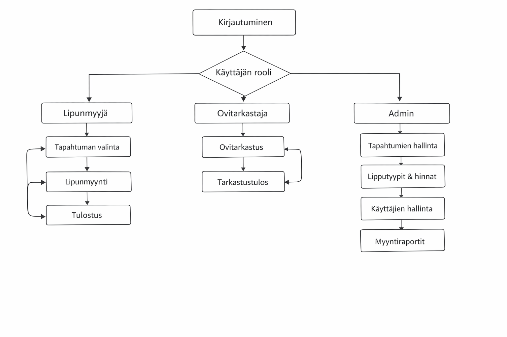

# Projektin nimi

Tiimi: Aitanova Azaliia, Karppinen-van Drongelen Riikka, Kumar Tejinder, Nguyen Khoa, Paajaste Maximus, Regnér Joel

## Johdanto

Johdantoon kirjoitetaan lyhyt, ytimekäs kuvaus siitä, mikä on projektin aihe,
kuka on asiakas (käyttäjä), mitä hän haluaa ja saa järjestelmältä, mitä
tekniikoita käytetään ja mitä konkreettisesti on valmiina, kun projekti päättyy.

-   Järjestelmän tarkoitus ja tiivis kuvaus siitä, mistä on kyse ja kenelle järjestelmä on tarkoitettu.
-   Toteutus- ja toimintaympäristö lyhyesti:  
    -   Palvelinpuolen ratkaisut ja teknologiat (esim. palvelinteknologia, mikä tietokantajärjestelmä on käytössä)
    -   Käyttöliittymäratkaisut ja teknologiat (esim. päätelaitteet: puhelin,
    täppäri, desktop)

## Järjestelmän määrittely

## Käyttäjäryhmät (roolit)

Lipunmyyjä
* Myy lippuja asiakkaille myyntipisteessä
* Tulostaa liput
* Näkee tapahtumien lipputilanteen

Ovitarkastaja
* Tarkistaa lipun koodin
* Merkitsee lipun käytetyksi
* Näkee lipun voimassaolon

Ylläpitäjä (Admin)
* Luo ja hallinnoi tapahtumia
* Määrittää lipputyypit ja hinnat
* Hallitsee käyttäjiä
* Tarkastelee myyntitietoja

## Käyttäjätarinat
Lipunmyyjä
* Lipunmyyjänä haluan myydä lipun asiakkaalle, jotta asiakas pääsee tapahtumaan.
* Lipunmyyjänä haluan tulostaa lipun, jotta asiakas saa fyysisen lipun.
* Lipunmyyjänä haluan nähdä jäljellä olevat liput, jotta voin seurata myyntitilannetta.

Ovitarkastaja
* Ovitarkastajana haluan skannata lipun koodin, jotta voin tarkistaa lipun aitouden.
* Ovitarkastajana haluan merkitä lipun käytetyksi, jotta samaa lippua ei voi käyttää uudelleen.

Ylläpitäjä
* Adminina haluan luoda tapahtumia, jotta lippuja voidaan myydä eri tapahtumiin.
* Adminina haluan määrittää lipun hinnat, jotta myynti voidaan hinnoitella oikein.

## Käyttöliittymä

Esitetään käyttöliittymän tärkeimmät (vain ne!) näkymät sekä niiden väliset siirtymät käyttöliittymäkaaviona. 

Jos näkymän tarkoitus ei ole itsestään selvä, se pitää kuvata lyhyesti.

Järjestelmä on selainpohjainen ja sitä käytetään ensisijaisesti myyntipisteen työasemalla. Käyttöliittymä toteutetaan yksinkertaiseksi ja nopeaksi, jotta lipunmyynti sujuu myös ruuhkatilanteissa.

### Päänäkymät:
* Kirjautuminen: käyttäjä kirjautuu sisään (lipunmyyjä / ovitarkastaja / admin).
* Tapahtumien valinta: lipunmyyjä näkee listan tapahtumista ja valitsee tapahtuman, johon myydään lippuja.
* Lipunmyynti: lipunmyyjä valitsee lipputyypin ja määrän, ja tekee myynnin.
* Tulostus: järjestelmä tulostaa lipun (tai liput) ja jokaisessa lipussa on yksilöllinen koodi.
* Ovitarkastus: ovitarkastaja syöttää tai skannaa lipun koodin ja järjestelmä näyttää onko lippu voimassa ja onko se jo käytetty.
* Admin-näkymä: admin hallinnoi tapahtumia, lipputyyppejä, hintoja ja käyttäjiä sekä tarkastelee myyntitietoja.

## Rajaukset (mitä ei tehdä tässä versiossa)
Tämän projektin nykyisessä toteutuksessa keskitytään lipunmyyntiin fyysisessä myyntipisteessä ja ovitarkastukseen. Seuraavat ominaisuudet eivät kuulu ensimmäiseen versioon:

* Maksujärjestelmien integraatiot (esim. korttimaksu- tai verkkopankkimaksut)
* Asiakkaiden käyttäjätilit ja kirjautuminen
* Sähköpostilipun lähetys (tässä versiossa liput tulostetaan myyntipisteessä)